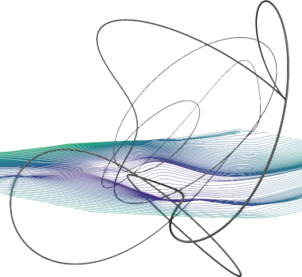
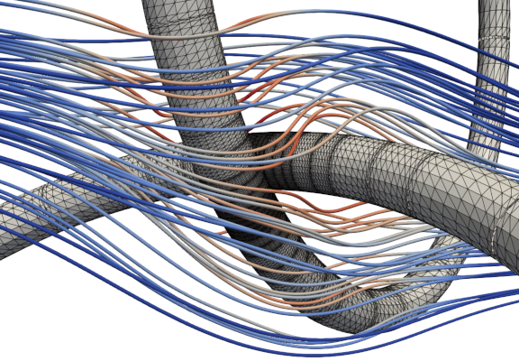
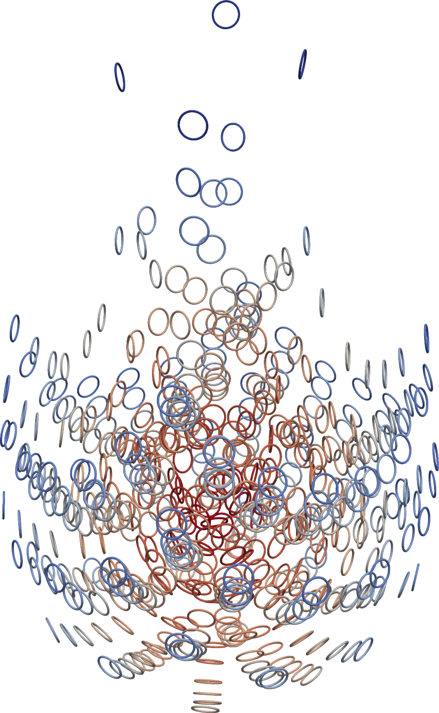

# Convergent slender-body quadrature (CSBQ)

Principal author **Dhairya Malhotra**, with additional code by **Alex Barnett**.
This work was done at the Center for Computational Mathematics at the Flatiron Institute, NY, NY.

This is a high-performance parallel C++ implementation of a high-order
adaptive Nystr&ouml;m quadrature for the boundary integral equations arising
in 3D Laplace and Stokes Dirichlet and rigid mobility boundary-value problems
for closed loop filaments of arbitrarily small circular cross-section.
Its quadrature setup cost is independent of the slenderness parameter, being around 20000 unknowns/sec per core, at 6-digit accuracy, away from close-to-touching regions.
Close-to-touching geometries may be handled to close to machine accuracy using adaptivity.
Open-ended fibers with rounded ends are possible and will be added soon.

This repository also contains MATLAB codes implementing the classical
slender-body theory asymptotic approximation,
and solving its linear inverse problem as needed for a mobility solve.

It is research software; use at your own risk. These pictures show some of the capabilities of the code (see the preprint below for details).


Stokes flow solution around rigid slender fiber with aspect ratio $10^3$, max error $10^{-10}$:


Stokes flow solution near close-to-touching rings, max error $10^{-11}$:


Sedimentation of 512 rings each of aspect ratio 20, timestepped to 7-digit accuracy on 160 cores:



### Minimum requirements to compile:

C++ compiler that supports C++11 standard


### Optional libraries for better performance:

BLAS, LAPACK, FFTW, MPI (distributed memory parallelism), PVFMM

### Instructions:

```bash
git clone https://github.com/dmalhotra/CSBQ.git
cd CSBQ
git submodule init
git submodule update
# update Makefile as necessary
make
./bin/demo1-geometry
```

For visualization do (after installing PARAVIEW):

```bash
make && ./bin/demo1-geometry && paraview vis/ring.pvtu
```

For slender-body numerical implementations in MATLAB, see `SBT/` directory.


### Overview:
This is a header-only C++ library, you only need to `#include <csbq.hpp>` in your code.
It relies on the [SCTL](https://github.com/dmalhotra/SCTL) library (included as a submodule) and the path to `sctl.hpp` must be provided to the C++ compiler.
The included Makefile may be used as a template for new projects.
Everything is contained within `sctl::` namespace.
Demo codes for learning to use the library are provided in `tutorial/`.
Precomputed quadrature tables for Laplace and Stokes kernels and some geometry files are provided in `data/`.
Test codes used to generate the results in the paper are provided in `test/`, along with SLURM scripts in `scripts/`.

### Citing this work

If you find this code useful in your research, please cite our preprint,
"Efficient Convergent Boundary Integral Methods for Slender Bodies,"
Dhairya Malhotra and Alex Barnett, arXiv:#### (2023).
