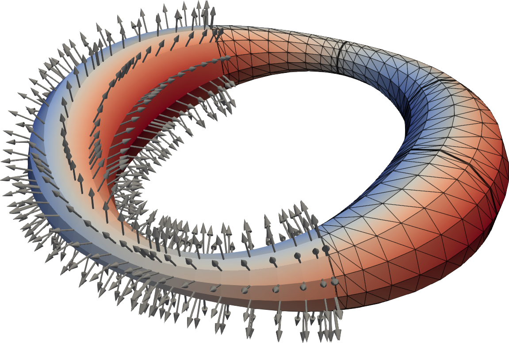

.. _demo1:

Demo 1: Geometry
================

The code (``tutorial/demo1-geometry.cpp``) demonstrates the basic usage of the ``SlenderElemList`` class, covering construction, file I/O, accessing surface geometry, and visualization.
The ``SlenderElemList`` class is designed to represent slender-body geometries and use them in boundary integral equation (BIE) methods.
For the full API documentation please refer to :ref:`slender_element.hpp <slender_element_hpp>`.

Construction of Slender-Body Geometry
--------------------------------------

To construct a slender-body geometry, follow these steps:

1. We partition the geometry along its centerline into panels (slender-elements).
   For each panel, we choose the discretization order (``ElemOrder``) along the centerline and the number of Fourier modes (``FourierOrder``).

   .. code-block:: cpp

      const Long Npanel = 8;
      Vector<Long> ElemOrderVec(Npanel), FourierOrderVec(Npanel);
      ElemOrderVec = 10; // Element orders along the length
      FourierOrder = 12; // Element orders in theta

   The reference discretization in the [0,1] interval nodes for a panel of order ``ElemOrder`` are given by ``CenterlineNodes(ElemOrder)``.
   For each panel, we determine the centerline coordinates (``Xc``) and cross-sectional radius (``eps``) at each discretization node along the centerline.
   In the following example code, we build ``Xc``, and ``eps`` for a circular loop:

   .. code-block:: cpp

      Vector<double> Xc, eps;
      for (Long i = 0; i < Npanel; i++) {
          // discretization nodes in [0,1] interval
          const Vector<double>& nodes = SlenderElemList<double>::CenterlineNodes(ElemOrderVec[i]);

          for (Long j = 0; j < ElemOrderVec[i]; j++) {
              const double phi = 2*const_pi<double>() * (i + nodes[j]) / Npanel; // circle parameterization phi in [0,2pi]
              Xc.PushBack(cos(phi)); // X-coord
              Xc.PushBack(sin(phi)); // Y-coord
              Xc.PushBack(0.0);      // Z-coord
              eps.PushBack(0.1);     // cross-sectional radius
          }
      }

2. Initialize the ``SlenderElemList`` object using ``ElemOrderVec``, ``FourierOrderVec``, ``Xc``, and ``eps``:

   .. code-block:: cpp

      SlenderElemList<double> elem_lst(ElemOrderVec, FourierOrderVec, Xc, eps);

File I/O
--------

The `SlenderElemList` class provides methods to read from and write to files in a human-readable format. To perform file I/O:

1. Write the geometry data to a file:

   .. code-block:: cpp

      elem_lst.Write("path/to/file.geom", comm);

2. Read geometry data from a file:

   .. code-block:: cpp

      elem_lst.Read<double>("path/to/file.geom", comm);

The geometry file contains the coordinates, the cross-sectional radius, and the orientation vector at the centerline nodes of each panel along the centerline.
An example of a geometry file is shown below:

   .. code-block:: sh

      #          X           Y           Z           r    orient-x    orient-y    orient-z   ElemOrder FourierOrder
        1.2812e-01  1.5108e-04  0.0000e+00  1.2500e-01  0.0000e+00  0.0000e+00  1.0000e+00          10           88
        1.2812e-01  1.3375e-03  0.0000e+00  1.2500e-01  0.0000e+00  0.0000e+00  1.0000e+00
        1.2812e-01  3.5943e-03  0.0000e+00  1.2500e-01  0.0000e+00  0.0000e+00  1.0000e+00
        1.2811e-01  6.7005e-03  0.0000e+00  1.2500e-01  0.0000e+00  0.0000e+00  1.0000e+00
        1.2809e-01  1.0352e-02  0.0000e+00  1.2500e-01  0.0000e+00  0.0000e+00  1.0000e+00
        1.2807e-01  1.4191e-02  0.0000e+00  1.2500e-01  0.0000e+00  0.0000e+00  1.0000e+00
        1.2804e-01  1.7842e-02  0.0000e+00  1.2500e-01  0.0000e+00  0.0000e+00  1.0000e+00
        1.2801e-01  2.0948e-02  0.0000e+00  1.2500e-01  0.0000e+00  0.0000e+00  1.0000e+00
        1.2799e-01  2.3205e-02  0.0000e+00  1.2500e-01  0.0000e+00  0.0000e+00  1.0000e+00
        1.2797e-01  2.4392e-02  0.0000e+00  1.2500e-01  0.0000e+00  0.0000e+00  1.0000e+00
        1.2797e-01  2.4694e-02  0.0000e+00  1.2500e-01  0.0000e+00  0.0000e+00  1.0000e+00          10           88
        1.2795e-01  2.5880e-02  0.0000e+00  1.2500e-01  0.0000e+00  0.0000e+00  1.0000e+00
        1.2792e-01  2.8137e-02  0.0000e+00  1.2500e-01  0.0000e+00  0.0000e+00  1.0000e+00
        1.2788e-01  3.1242e-02  0.0000e+00  1.2500e-01  0.0000e+00  0.0000e+00  1.0000e+00
        ....
 

Accessing Surface Geometry
--------------------------

You can retrieve the surface discretization nodes and normals using the ``GetNodeCoord`` method:

.. code-block:: cpp

   Vector<double> X, Xn;
   Vector<Long> element_wise_node_cnt;
   elem_lst.GetNodeCoord(&X, &Xn, &element_wise_node_cnt);

Visualization
-------------

Finally, you can visualize the geometry and surface normals using VTK. Write VTK visualization files using the ``WriteVTK`` method:

.. code-block:: cpp

   elem_lst.WriteVTK("path/to/output", Xn, comm); // visualize the surface normals

The resulting output file can be opened in ParaView:

   A circular ring with varying cross-section visualized in ParaView. The surface normal vectors are shown.

Compiling and Running the Code
------------------------------

To compile and run the provided code, navigate to the project root directory and run:

.. code-block:: bash

   make bin/demo1-geometry && ./bin/demo1-geometry

This will generate the geometry file ``data/ring.geom`` and the VTK visualization ``vis/ring.pvtu`` which can be opened in ParaView.

Complete Example Code
---------------------

.. raw:: html

   

    

.. literalinclude:: ../../tutorial/demo1-geometry.cpp
   :language: c++
  
