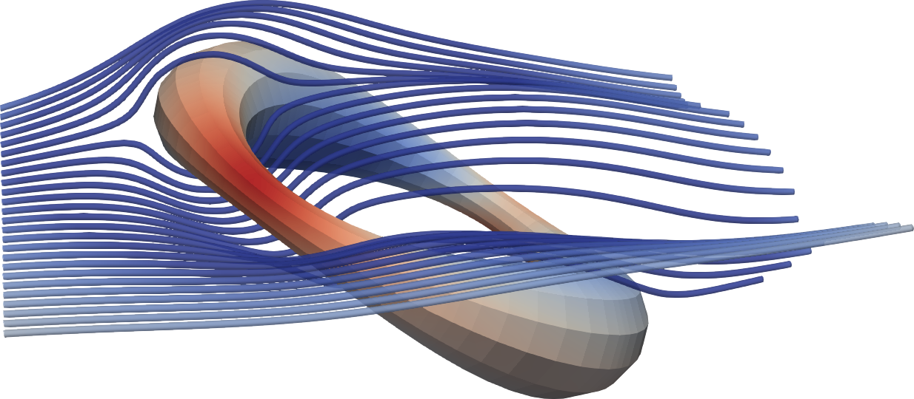

.. _demo3:

Demo 3: Solving Boundary Integral Equations (BIEs)
==================================================

The code (``tutorial/demo3-bie-solve.cpp``) demonstrates how to solve boundary integral equations (BIEs) using the CSBQ library.
In this demo we solve the Stokes Dirichlet boundary value problem (BVP) around a circular ring.

Step 1: Problem Definition
--------------------------

Given a bounded domain :math:`\Omega \in \mathbb{R}^3` with boundary :math:`\Gamma = \partial\Omega`, we want to solve the Stokes Dirichlet boundary value problem in the exterior of the domain,

.. math::

   \Delta \mathbf{u} - \nabla p &= 0 \quad \mbox{ in } \mathbb{R}^3 \setminus \overline{\Omega}, \\
        \nabla \cdot \mathbf{u} &= 0 \quad \mbox{ in } \mathbb{R}^3 \setminus \overline{\Omega}, \\
   \mathbf{u}|_{\Gamma} &= \mathbf{u}_0 \quad \mbox{ on } \Gamma.

where :math:`\mathbf{u}` and :math:`p` are the unknown fluid velocity and pressure in :math:`\mathbb{R}^ \setminus \overline{\Omega}`, and :math:`\mathbf{u}_0` is the given fluid velocity on :math:`\Gamma`.
In addition, we also assume that the fluid velocity at infinity decays to zero,

.. math::

   \mathbf{u}(\mathbf{x}) \rightarrow \mathbf{0} \quad \mbox{ as } |\mathbf{x}| \rightarrow \infty.

Step 2: Integral Equation Formulation
-------------------------------------

In the exterior of :math:`\Omega`, we represent the fluid velocity using the combined field representation,

.. math::

   \mathbf{u} = \mathcal{D}[\mathbf{\sigma}] + \eta \, \mathcal{S}[\mathbf{\sigma}] \quad \mbox{ in } \mathbb{R}^3 \setminus \overline{\Omega},

where :math:`\eta` is a scaling factor,  :math:`\mathcal{S}` and :math:`\mathcal{D}` are the Stokes single-layer and double-layer potential operators,

.. math::

   \mathcal{S}[\mathbf{\sigma}](\mathbf{x}) &\colon= \int_{\Gamma} S(\mathbf{x} - \mathbf{y}) \, \mathbf{\sigma}(\mathbf{y}) \, dS_{\mathbf{y}}, \\
   \mathcal{D}[\mathbf{\sigma}](\mathbf{x}) &\colon= \int_{\Gamma} D(\mathbf{x} - \mathbf{y}) \, \mathbf{\sigma}(\mathbf{y}) \, dS_{\mathbf{y}}, \\

and :math:`\mathbf{\sigma}` is an unknown density on :math:`\Gamma`.
With this representation, :math:`\mathbf{u}` satisfies the Stokes equations in the exterior domain and the velocity decay condition at infinity.
Applying the boundary condition on :math:`\Gamma`, we get a second-kind boundary integral equation (BIE) formulation,

.. math::

   (I/2 + D + \eta \, S) \mathbf{\sigma} = \mathbf{u}_0 \quad \mbox{ on } \Gamma,

where :math:`S` and :math:`D` are the Stokes single-layer and double-layer boundary integral operators.
After discretizing and solving for the unknown :math:`\sigma`, we can evaluate the velocity field :math:`\mathbf{u}` anywhere in 
:math:`\mathbb{R}^3 \setminus \overline{\Omega}` using the combined field representation formula above.

Step 3: Discretize the Geometry
-------------------------------

We create an object of type :ref:`SlenderElemList <slender_element_hpp>` and load the geometry file ``data/ring.geom`` into this object:

.. code-block:: cpp

   SlenderElemList<double> elem_lst;
   elem_lst.Read<double>("data/ring.geom", comm);

This is a collective MPI operation and the geometry is partitioned between the participating MPI processes in the communicator ``comm``.
Refer to :ref:`demo-1 <demo1>` to see how to build a geometry discretization.

Step 4: Discretize and Solve the Integral Equation
---------------------------------------------------

- **Define a Custom Kernel**:

  We build a custom kernel function that evaluates the sum of the Stokes double-layer kernel
  and the scaled single-layer kernel. The scaling parameter is passed as a template parameter.

  .. code-block:: cpp

     template <Long SL_scal> struct Stokes3D_CF_ {
       static const std::string& Name() {
         // Name determines what quadrature tables to use.
         // Single-layer quadrature tables also works for combined fields.
         static const std::string name = "Stokes3D-FxU";
         return name;
       }

       static constexpr Integer FLOPS() {
         return 50;
       }

       template <class Real> static constexpr Real uKerScaleFactor() {
         return 1 / (8 * const_pi<Real>());
       }

       template <Integer digits, class VecType>
       static void uKerMatrix(VecType (&u)[3][3], const VecType (&r)[3], const VecType (&n)[3], const void* ctx_ptr) {
         using Real = typename VecType::ScalarType;
         const auto SL_scal_ = VecType((Real)SL_scal);
         const auto r2 = r[0]*r[0] + r[1]*r[1] + r[2]*r[2];
         const auto rinv = approx_rsqrt<digits>(r2, r2 > VecType::Zero()); // Compute inverse square root
         const auto rinv2 = rinv * rinv;
         const auto rinv3 = rinv2 * rinv;
         const auto rinv5 = rinv3 * rinv2;
         const auto rdotn = r[0] * n[0] + r[1] * n[1] + r[2] * n[2];
         const auto rdotn_rinv5_6 = VecType((Real)6) * rdotn * rinv5;
         for (Integer i = 0; i < 3; i++) {
           for (Integer j = 0; j < 3; j++) {
             const auto ri_rj = r[i] * r[j];
             const auto ker_dl = ri_rj * rdotn_rinv5_6; // Double-layer kernel
             const auto ker_sl = (i == j ? rinv + ri_rj * rinv3 : ri_rj * rinv3); // Single-layer kernel
             u[i][j] = ker_dl + ker_sl * SL_scal_; // Combine kernels
           }
         }
       }
     };
     using Stokes3D_CF = GenericKernel<Stokes3D_CF_<4>>;

  For more details see `defining custom kernels <https://sctl.readthedocs.io/en/latest/tutorial/kernels.html>`_ in SCTL.

- **Initializing the Layer Potential Operator**:

  Next, we create a layer-potential operator using our custom kernel.
  We set the accuracy, and add the element list to the operator.
  
  .. code-block:: cpp
  
     Stokes3D_CF ker;
     BoundaryIntegralOp<double, Stokes3D_CF> LayerPotenOp(ker);
     LayerPotenOp.SetAccuracy(tol);
     LayerPotenOp.AddElemList(elem_lst);

- **Defining the Boundary Integral Operator**:

  Define the boundary integral operator using a lambda function:
  
  .. code-block:: cpp
  
     const auto BIO = [&LayerPotenOp](Vector<double>* U, const Vector<double>& sigma) {
       LayerPotenOp.ComputePotential(*U, sigma);
       (*U) += sigma * 0.5;
     };

- **Solving the Boundary Integral Equation**:

  We solve the boundary integral equation for the unknown ``sigma`` using the GMRES solver.
  We define the boundary condition, set up the GMRES solver, and solve the system.
  
  .. code-block:: cpp
  
     Vector<double> sigma, U0(LayerPotenOp.Dim(0));
     U0 = 1; // Set boundary condition to (Ux, Uy, Uz) = (1, 1, 1)
     GMRES<double> solver(comm);
     solver(&sigma, BIO, U0, tol);

Step 5: Post-processing
-----------------------

After solving the BIE, evaluate the velocity field in the volume and visualize it.

.. code-block:: cpp

   CubeVolumeVis<double> cube(50, 2.0, comm); // 50x50x50 points, side length 2
   LayerPotenOp.SetTargetCoord(cube.GetCoord()); // Set target coordinates for the operator
   Vector<double> U;
   LayerPotenOp.ComputePotential(U, sigma);
   cube.WriteVTK("vis/bie-solution", U - 1); // Write to VTK file

A cubic volume with 50x50x50 points and a side length of 2 is defined using the :ref:`CubeVolVis <utils_hpp>` class.
We then evaluate the boundary integral operator at the discretization nodes to get the fluid velocity field,
and write the VTK visualization of the fluid velocity field to the file ``vis/bie-solution.pvtu``.

   Streamlines visualizing Stokes flow around a circular ring.

Compiling and Running the Code
------------------------------

- **Without MPI**: Navigate to the project root directory and run:

   .. code-block:: bash

      make bin/demo3-bie-solve && ./bin/demo3-bie-solve

- **Without MPI**: In the project root directory, edit ``Makefile`` to set ``CXX=mpicxx`` and
  uncomment ``CXXFLAGS += -DSCTL_HAVE_MPI``. Then, run:

   .. code-block:: bash

      make bin/demo3-bie-solve && mpirun -n 2 --map-by slot:pe=1 ./bin/demo3-bie-solve

This will solve a Stokes Dirichlet BVP in the exterior of a loop geometry
and write the solution density ``sigma`` to a VTK visualization file ``vis/sigma.pvtu``.
It will also write a VTK visualization of the fluid velocity field in the volume to the file ``vis/bie-solution.pvtu``.

Complete Example Code
---------------------

.. raw:: html

   

    

.. literalinclude:: ../../tutorial/demo3-bie-solve.cpp
   :language: c++

